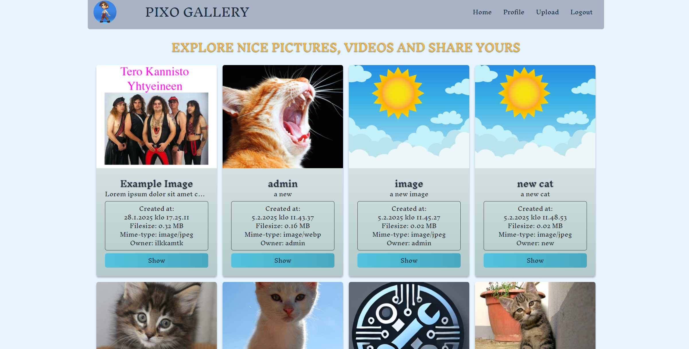
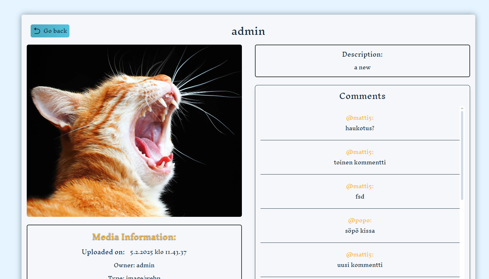
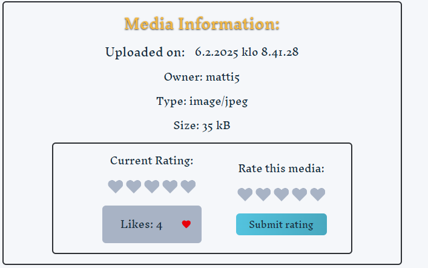
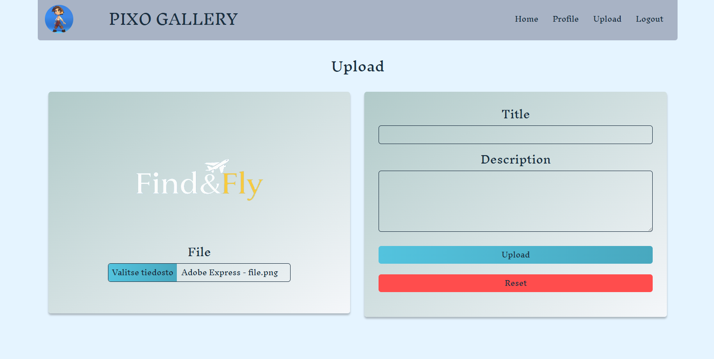

# PIXOGALLERY

# Link to software:

https://users.metropolia.fi/~miikavs/pixogallery/

# Toiminnallisuudet toteutettu:

## Median lataaminen sovellukseen

Käyttäjä voi ladata mediaa sovellukseen ja sovellus näyttää mediat
käyttäjälle etusivulla ja kertoo niiden perus tiedot. Käyttäjä voi avata
median isommalle ruudulle show napista jossa on enemmän toiminnallisuuksia.

## Kuvien poistaminen sekä muokkaaminen

Jos käyttäjä omistaa kuvan tai on admin hän voi poistaa tai muokata kyseistä kuvaa
kun on avannut kuvan. Poistaminen tapahtuu suoraan samasta näytöstä mutta muokkaaminen
avautuu uuteen ruutuun jossa voi antaa joko otsikon tai kuvatekstin uudelleen.

## Kuvien tykkäys, kommentointi sekä arvosteleminen ratingin avulla

Kun kuvan avaa siinä näkyy ruutu jossa on muiden käyttäjien kommentit sekä osio jossa
näkyy tykkäykset sekä rating. Käyttäjä pystyy myös laittamaan itse ratingin kuvalle.

## Käytetyt grafiikkakirjastot

Käytin iconeiden luomiseen react-iconsia:
https://react-icons.github.io/react-icons/

Ratingin toteutin käyttäen react-rating kirjastoa:
https://www.npmjs.com/package/@smastrom/react-rating

## Kuvakaappauksia käyttöliittymästä:

### Mainpage

### Kuvan aukaiseminen

### Mediainfo and likes + rating

### Upload näkymä

